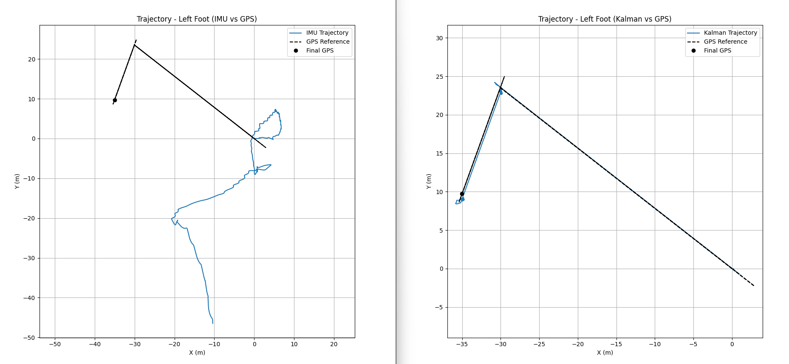

# AFERNANDEZ\_ms\_2024

## Position calculation using IMU9
This project processes, transforms, and stores data from IMU9 sensors for motion tracking, trajectory estimation, and analysis using time-series databases such as InfluxDB.

## Introduction

The main purpose of this project is to assist in the identification and analysis of gait features. The ambition is to characterize fine-grain attributes of the walking process, particularly for individuals affected by Multiple Sclerosis (MS).

## Motivation

This project focuses on seamlessly integrating data collected at the edge. High-frequency sensor data from Sensoria Health© instrumented socks is transmitted via BLE through custom Android or iOS apps and uploaded into an InfluxDB time-series database.

Additional tools analyze this data to identify valid activity periods and store them in a PostgreSQL relational database. Using specialized algorithms, walking periods longer than 7 seconds are detected and further analyzed.

The current goal is to extract detailed low-level gait features, such as stride length, cadence, swing distance, and other movement metrics to enable precise assessment of mobility impairments.

## Project Structure

```
AFERNANDEZ_ms_2024/
│
├── InfluxDBms/            # Python package for InfluxDB data access and querying
├── msGeom/                # Core module for sensor fusion, trajectory estimation, and visualization
├── test_InfluxDB/         # Scripts for querying InfluxDB and exporting to Excel
├── transform_data/        # Data transformation and motion analysis pipeline
│
├── docs/                  # Project documentation
├── dist/                  # Distribution artifacts
├── .vscode/               # VSCode settings
│
├── config.yaml            # General project configuration
│
├── LICENSE
├── README.md              # This file
├── poetry.lock            # Dependency lock file
├── pyproject.toml         # Poetry project definition
├── .gitignore
```

## Requirements

To use the full gait analysis pipeline, you need to install the required Python packages.

You have two options:

### Option 1: Install via `requirements.txt`

```bash
pip install -r requirements.txt
```

### Option 2: Install manually

```bash
pip install numpy>=1.24.0 pandas>=2.2.3 PyYAML>=6.0.2 matplotlib>=3.10.1 plotly>=5.20.0 \
folium>=0.15.1 ahrs>=0.4.0 pyproj>=3.6.1 filterpy>=1.4.5 scipy>=1.12.0 geopy>=2.4.0 \
tabulate argparse
```

You can also use [Poetry](https://python-poetry.org/) as an alternative for dependency management:

```bash
pip install poetry
poetry install
```

---

## Module Descriptions

### `InfluxDBms`

A dedicated package for handling InfluxDB connections and queries. It includes the `influxdb_tools.py` module, which defines the `cInfluxDB` class for querying and retrieving data into `pandas` DataFrames. It's tightly integrated with `test_InfluxDB/extract_data.py` for streamlined querying.

### `test_InfluxDB`

This module provides tools to test and validate the InfluxDB querying process. The main script, `extract_data.py`, creates an instance of the `cInfluxDB` class from `influxdb_tools` to retrieve sensor data and export it as an Excel file. It supports CLI configuration for time ranges and measurement parameters. Outputs are stored in the `out/` folder.

### `msGeom`

This module provides core classes for preprocessing sensor data, step detection, sensor fusion, and visualization. It supports IMU+GPS analysis pipelines including:

* Resampling and preprocessing raw sensor data
* Orientation filtering (Madgwick, Mahony)
* Kalman filtering for position estimation
* Step and stride detection
* Metric computation and visualization using Plotly, Matplotlib, or Folium

### `transform_data`

This folder contains scripts and classes for processing IMU and GPS data. It includes orientation estimation filters (Madgwick, Mahony), position refinement methods (Kalman, EKF, complementary filters), and tools for drift correction. It also supports static plots and interactive maps for data visualization.


## Usage

1. **Configure the system**:

   * Edit `config.yaml` with appropriate parameters

2. **Extract data**:

   * Use the script `test_InfluxDB/extract_data.py`  for export data from InfluxDB


3. **Transform and analyze data**:

   * Use scripts in `transform_data/` and `msGeom/` for motion processing, visualization, and export. 
   * The main analysis script is `transform_data/stride_measurement.py`, which performs stride detection, filtering, and feature extraction.


## Results and Visualizations

This section presents a summary of the results obtained using sensor data collected from the left foot during a 60-second walking session. The pipeline involves IMU signal preprocessing, Kalman filtering, trajectory estimation, and step detection using modG peak analysis.

---

### Trajectory Estimation: IMU vs. GPS

The two plots below compare estimated 2D trajectories using:

* Raw IMU double integration
* Kalman-filtered estimation

Both are compared to GPS reference paths.



**Key insights:**

* IMU-only trajectory shows substantial drift.
* Kalman filtering aligns closely with the actual GPS trajectory.

---

### Quantitative Comparison Summary

| Metric                          | IMU       | Kalman Filter |
| ------------------------------- | --------- | ------------- |
| Final position error (vs. GPS)  | 61.32 m   | **0.82 m**    |
| Estimated total distance        | 110.20 m  | 76.48 m       |
| Total GPS reference distance    | -         | 70.44 m       |
| Average step length             | 0.046 m   | 0.032 m       |
| Average velocity                | 2.209 m/s | -             |
| Steps detected (modG method)    | 47        | -             |
| Valid strides (after filtering) | -         | 6             |
| GPS-aligned points (Kalman)     | -         | 99.9%         |

> **Result:** The Kalman filter reduced trajectory error by more than 98% compared to raw IMU integration.

---

### Step Detection using modG Signal

The signal below shows the modG magnitude from the IMU accelerometer. Steps are detected as peak triplets: entry (blue), main (red), and exit (green).


---

### Valid Stride Samples (After Filtering)

Six valid strides were detected after applying distance and GPS consistency filters:

| Time (s) | Stride Length (m) |
| -------- | ----------------- |
| 4.65     | 0.423             |
| 34.75    | 0.215             |
| 40.08    | 0.543             |
| 41.25    | 0.376             |
| 42.40    | 0.229             |
| 45.38    | 0.204             |

---

### Summary

The combination of sensor fusion (Kalman filtering), peak detection, and stride validation yielded reliable gait metrics with high alignment to GPS reference data. The Kalman-based trajectory estimation showed strong spatial accuracy, suggesting that this pipeline is viable for detailed gait feature extraction in real-world walking scenarios.


## License

This project is licensed under the MIT License. See the `LICENSE` file for more details.
