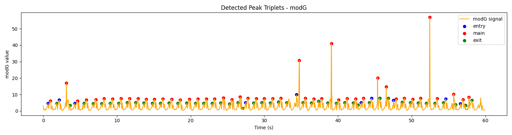
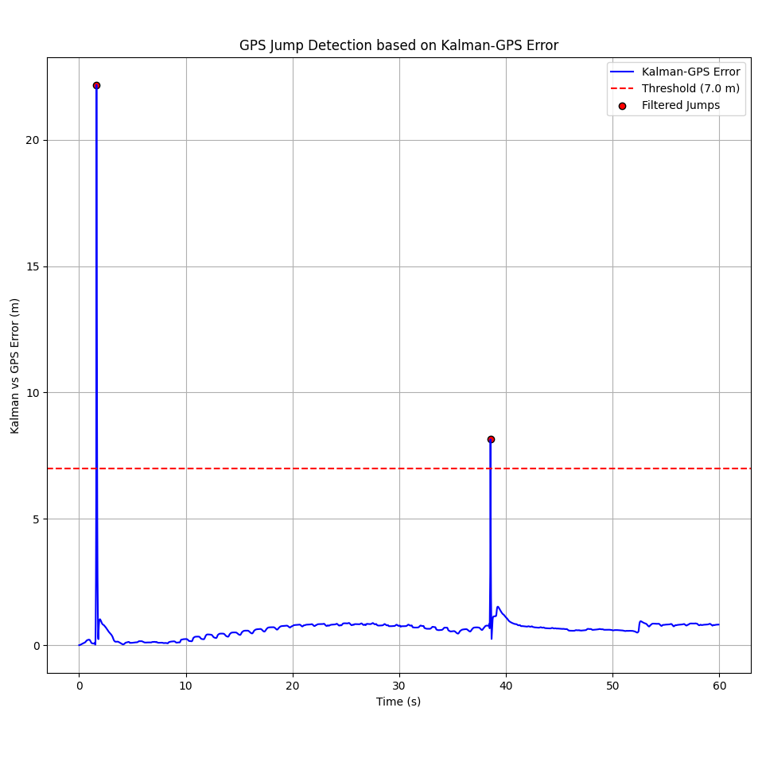

# AFERNANDEZ\_ms\_2024

## Position calculation using IMU9
This project processes, transforms, and stores data from IMU9 sensors for motion tracking, trajectory estimation, and analysis using time-series databases such as InfluxDB.

## Introduction

The main purpose of this project is to assist in the identification and analysis of gait features. The ambition is to characterize fine-grain attributes of the walking process, particularly for individuals affected by Multiple Sclerosis (MS).

## Motivation

Multiple Sclerosis is a chronic neurological disorder that can cause significant gait impairments, including reduced balance, altered cadence, and shorter stride length. Traditional gait analysis methods —often performed in controlled laboratory settings— are limited by their high cost, sporadic measurements, and lack of representation of a patient’s everyday mobility.

This project focuses on seamlessly integrating data collected at the edge. High-frequency sensor data from Sensoria Health© instrumented socks, which embed IMUs, pressure sensors, and GPS modules, is transmitted via Bluetooth Low Energy (BLE) through custom Android or iOS applications and uploaded into an InfluxDB time-series database.

This wearable technology enables continuous, non-invasive gait monitoring in the patient’s daily environment. The data pipeline developed in collaboration between the Polytechnic University of Madrid and the Public Hospital of Getafe integrates high-frequency inertial and positional data to:

* Capture raw acceleration, angular velocity, magnetic field, pressure, and GPS coordinates.

* Synchronize and preprocess multi-sensor data for accurate alignment.

* Estimate foot orientation using sensor fusion algorithms (e.g., Madgwick filter).

* Compute 3D foot trajectory and correct drift using techniques such as ZUPT and ZUPH.

* Detect and segment strides, calculating spatiotemporal gait metrics.

The system enables early detection of gait alterations, supports clinical decision-making, and facilitates personalized rehabilitation plans.

## Project Structure

```
AFERNANDEZ_ms_2024/
│
├── InfluxDBms/            # Python package for InfluxDB data access and querying
├── msGeom/                # Core module for sensor fusion, trajectory estimation, and visualization
├── test_InfluxDB/         # Scripts for querying InfluxDB and exporting to Excel
├── transform_data/        # Data transformation and motion analysis pipeline
│
├── docs/                  # Project documentation
├── dist/                  # Distribution artifacts
├── .vscode/               # VSCode settings
│
├── config.yaml            # General project configuration
│
├── LICENSE
├── README.md              # This file
├── poetry.lock            # Dependency lock file
├── pyproject.toml         # Poetry project definition
├── .gitignore
```

## Requirements

To use the full gait analysis pipeline, you need to install the required Python packages.

You have two options:

### Option 1: Install via `requirements.txt`

```bash
pip install -r requirements.txt
```

### Option 2: Install manually

```bash
pip install numpy>=1.24.0 pandas>=2.2.3 PyYAML>=6.0.2 matplotlib>=3.10.1 plotly>=5.20.0 \
folium>=0.15.1 ahrs>=0.4.0 pyproj>=3.6.1 filterpy>=1.4.5 scipy>=1.12.0 geopy>=2.4.0 \
tabulate argparse
```

You can also use [Poetry](https://python-poetry.org/) as an alternative for dependency management:

```bash
pip install poetry
poetry install
```

---

## Module Descriptions

### `InfluxDBms`

A dedicated package for handling InfluxDB connections and queries. It includes the `influxdb_tools.py` module, which defines the `cInfluxDB` class for querying and retrieving data into `pandas` DataFrames. It's tightly integrated with `test_InfluxDB/extract_data.py` for streamlined querying.

### `test_InfluxDB`

This module provides tools to test and validate the InfluxDB querying process. The main script, `extract_data.py`, creates an instance of the `cInfluxDB` class from `influxdb_tools` to retrieve sensor data and export it as an Excel file. It supports CLI configuration for time ranges and measurement parameters. Outputs are stored in the `out/` folder.

### `msGeom`

This module provides core classes for preprocessing sensor data, step detection, sensor fusion, and visualization. It supports IMU+GPS analysis pipelines including:

* Resampling and preprocessing raw sensor data
* Orientation filtering (Madgwick, Mahony)
* Kalman filtering for position estimation
* Step and stride detection
* Metric computation and visualization using Plotly, Matplotlib, or Folium

### `transform_data`

This folder contains scripts and classes for processing IMU and GPS data. It includes orientation estimation filters (Madgwick, Mahony), position refinement methods (Kalman, EKF, complementary filters), and tools for drift correction. It also supports static plots and interactive maps for data visualization.


## Usage

1. **Configure the system**:

   * Edit `config.yaml` with appropriate parameters

2. **Extract data**:

   * Use the script `test_InfluxDB/extract_data.py`  for export data from InfluxDB


3. **Transform and analyze data**:

   * Use scripts in `transform_data/` and `msGeom/` for motion processing, visualization, and export. 
   * The main analysis script is `transform_data/stride_measurement.py`, which performs stride detection, filtering, and feature extraction.


## Example Results

To validate the pipeline, we processed a **1-minute recording from the left foot** using **Sensoria IMU9 socks**.  
This dataset illustrates the complete workflow: stride detection, trajectory estimation, GPS correction, and error analysis.

### Quantitative Summary

| Metric                  | Value                                                   |
|-------------------------|---------------------------------------------------------|
| Total distance (GPS)    | 70.44 m                                                 |
| IMU trajectory          | Distance = 110.20 m  \|  Final error with GPS = 61.32 m |
| Kalman trajectory       | Distance = 76.48 m   \|  Final error with GPS = 0.82 m  |
| Steps detected (modG)   | 47                                                      |
| Mean Kalman-GPS error   | 0.65 m (99.7% of points < 5 m)                          |

> **Key insight:** Kalman filtering strongly reduces drift, aligning the estimated path with GPS while maintaining stride-level resolution.

---

### GPS Jump Detection

Abnormal GPS deviations (“jumps”) were detected during the trial.  
Each row indicates the timestamp of the anomaly and the associated Kalman-GPS error.

| Time (s) | Error (m) |
|----------|-----------|
| 1.62     | 22.17     |
| 38.55    | 8.14      |

---

### Visual Results

#### Stride Detection (modG)


#### Raw IMU vs GPS Trajectory


#### Kalman-corrected Trajectory vs GPS


#### GPS Jump Detection


---

### Summary

This example demonstrates the system’s ability to process continuous gait data, correct GPS errors, and output accurate stride-level metrics under real-world walking conditions.  
The combination of **sensor fusion (Kalman filtering)**, **peak detection**, and **stride validation** yielded reliable gait metrics with strong spatial accuracy and high alignment to GPS reference data. This confirms the viability of the pipeline for detailed gait feature extraction in clinical and research scenarios.


## License

This project is licensed under the MIT License. See the `LICENSE` file for more details.
