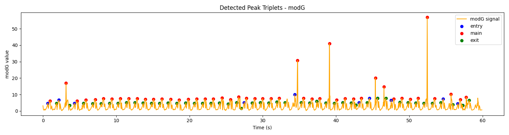
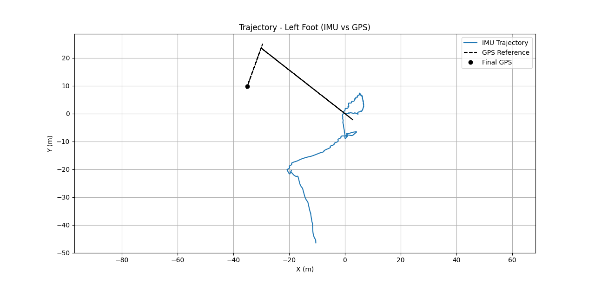
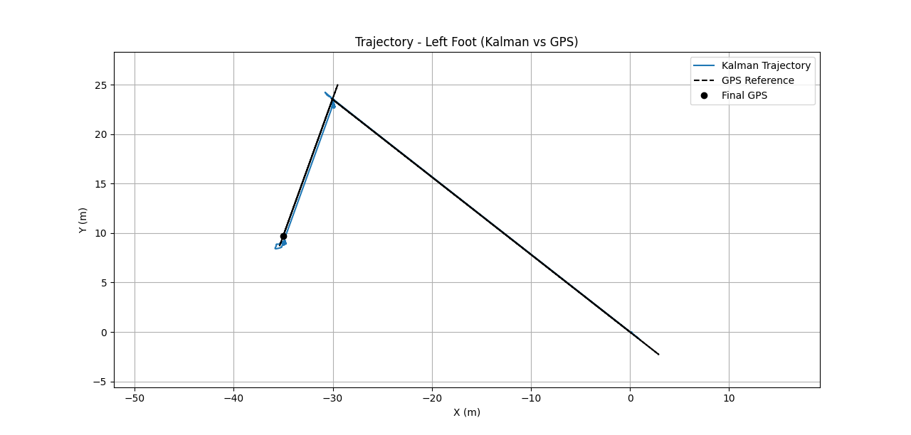
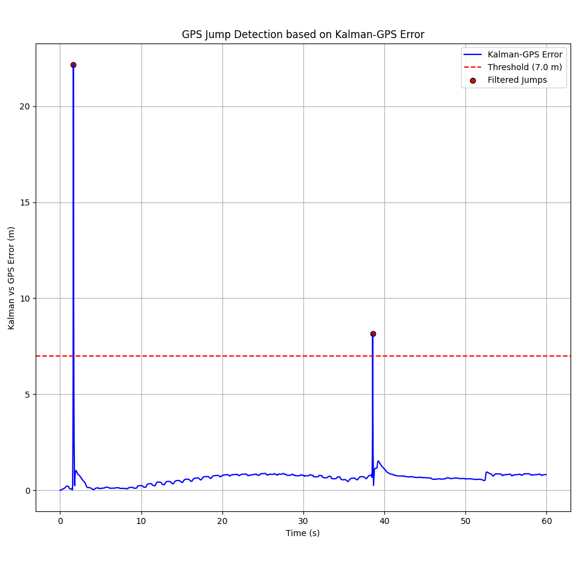

Results
=======

In this section we processed a **one-minute recording from the left foot** using **Sensoria IMU9 socks**.  
The dataset illustrates the complete workflow of stride detection, trajectory estimation, GPS correction, and error analysis.  
It includes both quantitative metrics and key visualizations that validate the performance of the processing pipeline.

Quantitative Summary
--------------------

The following table summarizes the main distance and error metrics obtained from GPS, raw IMU integration, and the Kalman filter, as well as stride detection results.

+-------------------------+------------------------------------------------------+
| Metric                  | Value                                                |
+=========================+======================================================+
| Total distance (GPS)    | 70.44 m                                              |
+-------------------------+---------------------+--------------------------------+
| IMU trajectory          | Distance = 110.20 m | Final error with GPS = 61.32 m |
+-------------------------+---------------------+--------------------------------+
| Kalman trajectory       | Distance = 76.48 m  | Final error with GPS = 0.82 m  |
+-------------------------+---------------------+--------------------------------+
| Steps detected (modG)   | 47                                                   |          
+-------------------------+------------------------------------------------------+
| Mean Kalman-GPS error   | 0.65 m (99.7% of points < 5 m)                       |
+-------------------------+------------------------------------------------------+

GPS Jump Detection
------------------

The next table reports abnormal GPS deviations (“jumps”) detected during the trial.  
Each row indicates the timestamp of the anomaly and the associated Kalman-GPS error.

+-------------------------+----------------+-----------------+
| Metric                  | Time (s)       | Error (m)       |
+=========================+================+=================+
| GPS jumps detected      | 1.62           | 22.17           |           
|                         +----------------+-----------------+ 
|                         | 38.55          | 8.14            |
+-------------------------+----------------+-----------------+

Interpretation
--------------

The quantitative results highlight the importance of sensor fusion.  
While the raw IMU trajectory accumulated a large drift (61.32 m error), the Kalman filter reduced the final error to only 0.82 m, closely matching the GPS reference distance (70.44 m).  
Additionally, the detection of 47 strides and the low mean Kalman-GPS error (0.65 m) confirm the robustness of the system at both the **spatiotemporal** and **step-detection** levels.

Visualizations
--------------

The following figures illustrate the different stages of the analysis pipeline:

   **Figure 1.** Stride detection (modG)

   **Figure 2.** Raw IMU vs GPS trajectory

   **Figure 3.** Kalman-corrected trajectory vs GPS

   **Figure 4.** GPS jump detection

Conclusion
----------

The system is capable of processing continuous gait data, detecting strides, correcting for GPS errors, and providing accurate spatiotemporal gait metrics under real-world walking conditions.  
The combination of Kalman filtering and stride segmentation yields trajectories that are both precise and clinically interpretable.

